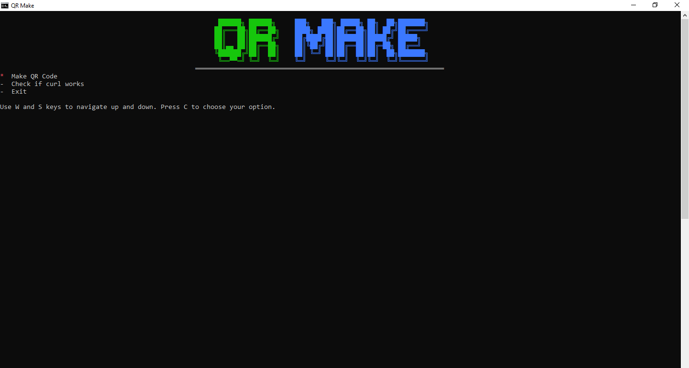

# QRmake
</img>
Make QR codes with a simple batch script.

# How to use
There are 3 things you can do at the main menu. Make a QR code, check if curl is installed, or exit the script.
  
# Making a QR code
It will ask you to type in data to put in the QR code. If the data contains spaces, you will have to make seperators. It will ask you if you
want to save it to a file so it is easier to keep, you can choose yes or no. If YES is chosen, it will create a directory called QRCodes in the
current directory. It will also check if there is a file that has contains the QRCode that you are generating. If it finds the file, it will
ask you if you want to show the file instead of generating a new code. The codes are stored in a .qrm file, which is just a plain text file so
do not worry.

# Checking if curl is installed
The command called "curl" is needed for this script, so I have added an option that helps checking if it is properly installed.

# Exiting
When you want to exit, choose exit.
